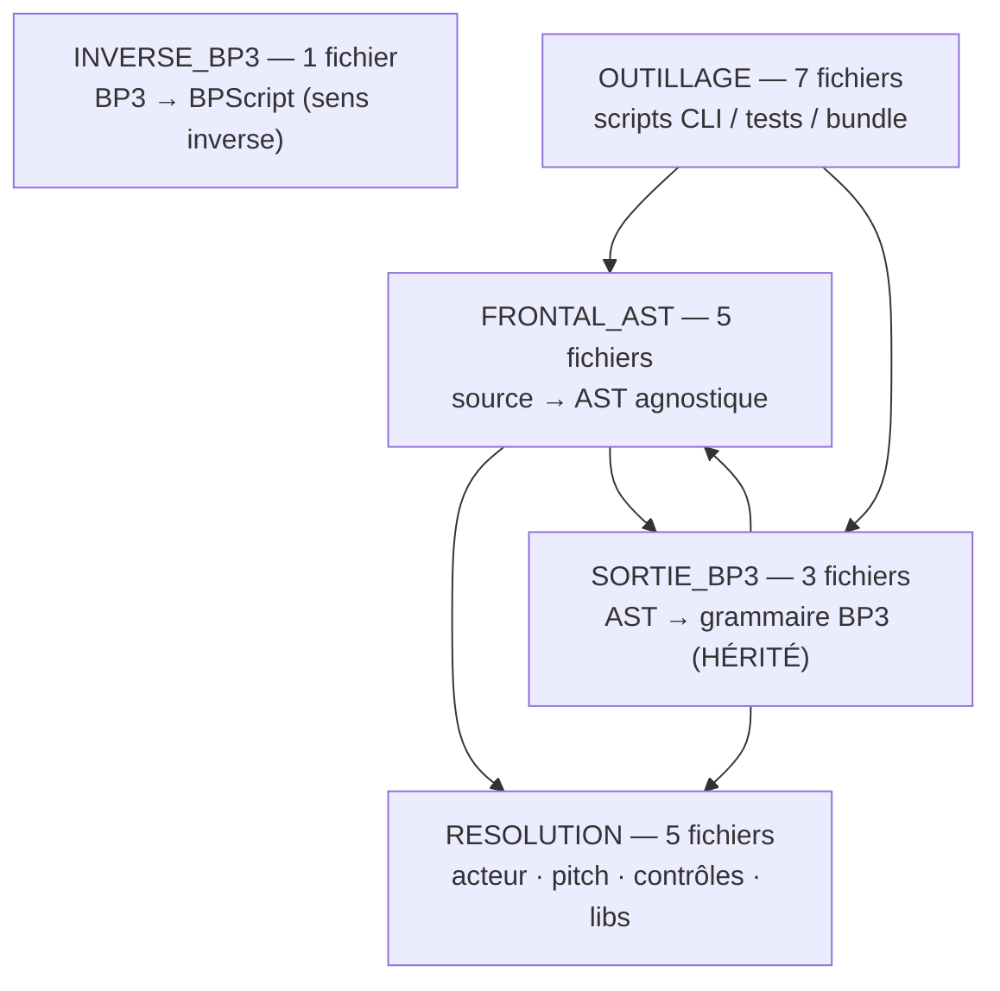
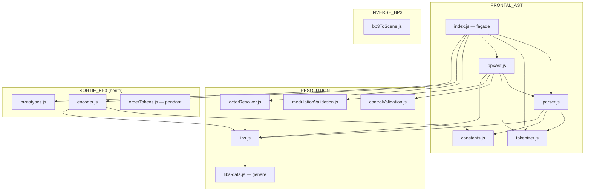

# Carte du réel — transpileur BPScript (`src/transpiler/`)

> **Ce qui EST** (photo du code, régénérable). Carte produite par la machine
> (dependency-cruiser + `partition.cjs`), rôles lus dans les en-têtes des fichiers.
> Le sémantique (« bon job ») reste la relecture de Romain. Généré le 2026-06-29.

## Portée

- **Cartographié** : `src/transpiler/**/*.js` — 21 fichiers de code, ~9,5 k lignes.
- **Exclus** : `.claude/worktrees/` (copies git de travail), `_archive/` (legacy).
- **Données, pas du code** : 115 dossiers `test/grammars/` (scènes `.bps` + snapshots) =
  fixtures/oracles, comptés et mis de côté, jamais cartographiés comme du flux.

## Preuve « zéro orphelin »

```
modules: 25 = code rangé: 21 + données: 0 + ext: 4 (builtins Node) + NON RANGÉS: 0
flèches code: 26 = entre-blocs: 17 + internes: 9
dépendances circulaires: 0   (règle no-circular, dependency-cruiser)
```

**21/21 fichiers de code rangés dans exactement un bloc, 0 non-rangé, 0 cycle.**

## Carte — blocs (la forme)



## Carte — fichiers (le détail du flux)



> `orderTokens.js` et `bp3ToScene.js` n'ont **aucun importeur dans le périmètre** (voir Anomalies).
> Le bloc OUTILLAGE (7 scripts CLI) est volontairement non dessiné au fichier près : ce sont des
> points d'entrée `node x.js`, pas des modules de bibliothèque.

## Rôles (lus dans les en-têtes du code)

| Fichier | L | Bloc | Rôle (en-tête) |
|---|--:|---|---|
| `tokenizer.js` | 336 | FRONTAL | Texte source → flux de jetons (EBNF couche 5) |
| `parser.js` | 3075 | FRONTAL | Jetons → AST (EBNF couches 1-4 + AST) |
| `bpxAst.js` | 205 | FRONTAL | Production de l'AST BPx PROPRE (sans format BP3) |
| `index.js` | 85 | FRONTAL | Façade : `compileBPS` (BP3 hérité) + `compileToBPxAST` (BPx) |
| `constants.js` | 34 | FRONTAL | Constantes partagées (table opérateurs BP3) |
| `actorResolver.js` | 194 | RESOLUTION | Résolution d'acteur (alphabet/tuning/octaves/transport) |
| `libs.js` | 327 | RESOLUTION | Chargeur de librairies (JSON → contrôles/symboles/CV) |
| `libs-data.js` | 42 | RESOLUTION | **Généré** par `libs-bundle.js` (bundle JSON) — ne pas éditer |
| `controlValidation.js` | 78 | RESOLUTION | Validation des VALEURS de contrôle runtime |
| `modulationValidation.js` | 133 | RESOLUTION | Validation des NOMS d'entrées de modulation |
| `encoder.js` | 1657 | SORTIE_BP3 | AST → texte grammaire BP3 (**hérité, ne pas toucher**) |
| `prototypes.js` | 165 | SORTIE_BP3 | Génère les fichiers prototypes BP3 `-so.` (durées) |
| `orderTokens.js` | 92 | SORTIE_BP3 | Tokenisation « ordre » de la production canonique BP3 |
| `bp3ToScene.js` | 1954 | INVERSE | Transpileur INVERSE BP3 → BPScript |
| `libs-bundle.js` | 48 | OUTILLAGE | Génère `libs-data.js` depuis les JSON `lib/` |
| `compare.js` | 179 | OUTILLAGE | Compare scènes ↔ grammaires d'origine (CLI) |
| `show-diffs.js` | 60 | OUTILLAGE | Affiche les diffs règle-à-règle (CLI) |
| `test.js` | 192 | OUTILLAGE | Lance les tests (CLI) |
| `validate.js` | 245 | OUTILLAGE | Lance la validation (CLI) |
| `validate-all.js` | 279 | OUTILLAGE | Valide toutes les grammaires d'origine (CLI) |
| `validate-wasm.js` | 129 | OUTILLAGE | Lance les tests via WASM (CLI) |

## Deux voies de sortie dans la façade (`index.js`)

| Voie | Entrée | Sortie | Statut |
|---|---|---|---|
| `compileToBPxAST(src)` | `.bps` | `{ ast, errors, warnings }` (AST agnostique) | **active** (frontière BPx) |
| `compileBPS(src)` | `.bps` | `{ grammar, alphabetFile, prototypesFile, … }` (BP3) | **héritée** — ne pas toucher |

La voie PROPRE (`bpxAst.js`) ne traverse **jamais** `encoder/prototypes/orderTokens` (loi BPx-only,
gardée — voir `docs/arch/garde-preuve.md`). La façade, elle, expose les deux voies côte à côte.

## Anomalies / candidats (à confronter, pas à trancher seul)

1. **`orderTokens.js` — module pendant.** Exporte `tokenizeOrder` mais **aucun importeur dans
   le dépôt**. Son en-tête le destine à deux consommateurs HORS dépôt (oracle texte ; runtime
   texte Kanopi). Soit consommé hors périmètre (à confirmer), soit code mort résiduel.
2. **`bp3ToScene.js` (1954 L) — île.** Sens INVERSE (BP3→BPScript), déconnecté de la chaîne
   avant ; atteint uniquement par des tests (`test/test_bp3_to_scene.cjs`, `test_bolsize_alias.js`).
   Vivant mais hors flux de compilation principal.
3. **`constants.js` partagé** par FRONTAL (`parser`) ET SORTIE_BP3 (`encoder`) → d'où la flèche
   `SORTIE_BP3 → FRONTAL`. Table d'opérateurs BP3 ; placement à arbitrer (infra partagée vs BP3).
4. **`encoder.js` (1657 L) et `parser.js` (3075 L)** = les deux géants. `parser.js` porte la
   bannière d'AUTORITÉ (`_AUTORITE.md`). Profondeur à zoomer si un chantier l'exige (pas ici).
