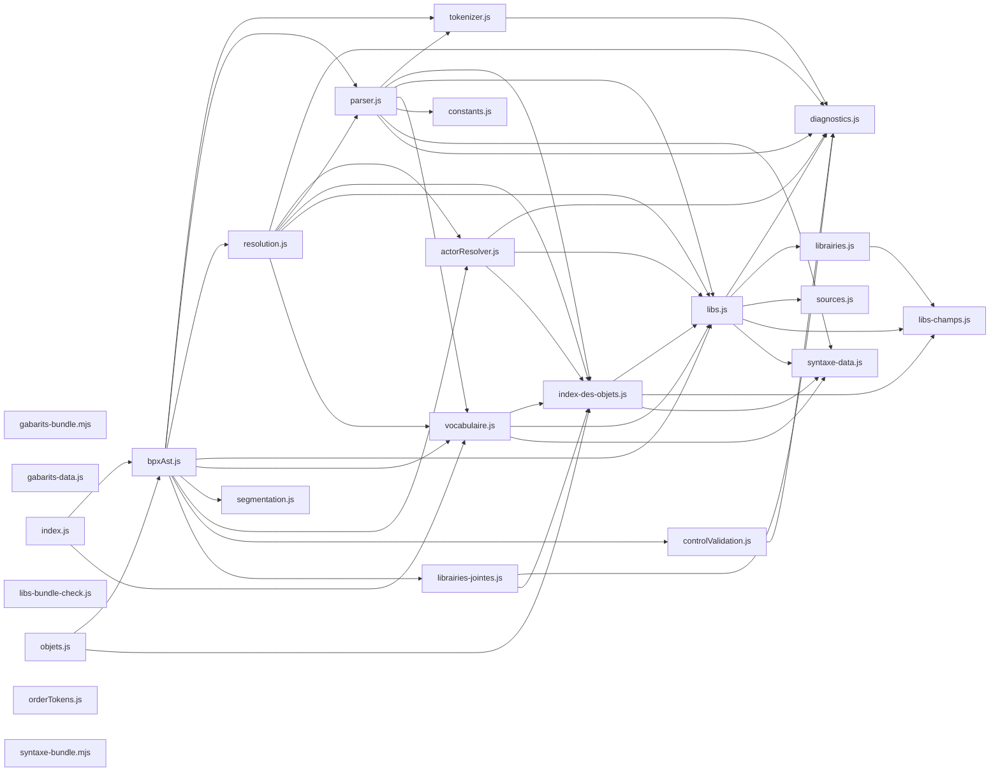

# Carte du réel — transpileur BPScript (`src/transpiler/`)

> **CE DOCUMENT SE GÉNÈRE** — `npm run carte`, appelé par le portillon. Toute édition à la
> main est écrasée à la passe suivante. Ce qui ENSEIGNE — la cible, l'écart, le jugement —
> vit dans le document d'architecture, chez Atlas, qui cite celui-ci.
## Ce qui est mesuré

- **24 modules** dans `src/transpiler/`, **15774 lignes**.
- Le **rôle** est lu dans l'en-tête de chaque fichier, verbatim — jamais interprété.
- Les **arêtes** sont les imports d'un module vers un voisin du même dossier.

## Modules

| Module | Lignes | Importe | Importé par | Rôle (lu dans l'en-tête) |
| --- | ---: | ---: | ---: | --- |
| `parser.js` | 7694 | 7 | 2 | BPScript Parser |
| `resolution.js` | 2979 | 6 | 1 | L'ÉTAGE QUI RÉSOUT — le troisième des quatre, et le seul qui n'avait pas de domicile. |
| `libs.js` | 1220 | 5 | 6 | BPScript Library Loader |
| `librairies.js` | 656 | 1 | 1 | LA LECTURE DES LIBRAIRIES — une source écrite dans le langage devient un objet du registre. |
| `actorResolver.js` | 582 | 3 | 2 | BPScript Actor Resolver |
| `tokenizer.js` | 535 | 1 | 2 | BPScript Tokenizer |
| `bpxAst.js` | 519 | 9 | 2 | Produit l'AST BPx depuis le source `.bps`, SANS l'ancien format BP3 et SANS table |
| `index-des-objets.js` | 390 | 3 | 6 | L'INDEX DES OBJETS — ce que les librairies déclarent, rendu comme des objets, pour la porte |
| `librairies-jointes.js` | 145 | 2 | 1 | L'ARBRE JOINT LE CONTENU DES LIBRAIRIES QU'IL INVOQUE — décision de Romain, 2026-09-02. |
| `syntaxe-data.js` *(généré)* | 126 | 0 | 4 | — |
| `orderTokens.js` | 123 | 0 | 0 | — |
| `controlValidation.js` | 107 | 1 | 1 | Collecte récursivement toutes les paires de SettingBag de l'AST. |
| `libs-champs.js` | 98 | 0 | 3 | LES CHAMPS DE FICHIER D'UNE LIBRAIRIE — déclarés UNE FOIS, pour tous mes lecteurs. |
| `vocabulaire.js` | 89 | 3 | 4 | LE VOCABULAIRE DU LANGAGE — la porte d'éditeur, DÉRIVÉE de la porte des objets. |
| `syntaxe-bundle.mjs` | 88 | 0 | 0 | GÉNÉRATEUR DE LA PORTE DU SCHÉMA DE SYNTAXE. |
| `segmentation.js` | 81 | 0 | 1 | LA SEGMENTATION D'UN NOM COLLÉ — plus long préfixe, glouton, sans retour arrière. |
| `diagnostics.js` | 79 | 0 | 7 | LES DIAGNOSTICS — UN CODE STABLE, UN TEXTE QUI VIT AILLEURS. |
| `gabarits-bundle.mjs` | 57 | 0 | 0 | GÉNÉRATEUR DE LA PORTE DES GABARITS DE RÉGLAGES NATIFS. |
| `libs-bundle-check.js` | 50 | 0 | 0 | — |
| `sources.js` | 48 | 0 | 1 | LES SOURCES DE LIBRAIRIE — ce que `lib/` contient, rendu comme du texte. |
| `index.js` | 38 | 2 | 0 | BPScript Transpiler — Façade |
| `constants.js` | 33 | 0 | 1 | BPScript — constantes partagées transpileur |
| `objets.js` | 29 | 2 | 0 | LA PORTE DES OBJETS — ce qu'une librairie déclare, rendu comme des objets et non comme une table |
| `gabarits-data.js` *(généré)* | 8 | 0 | 0 | — |

## Flux réel

```mermaid
flowchart LR
  actorResolver_js["actorResolver.js"]
  bpxAst_js["bpxAst.js"]
  constants_js["constants.js"]
  controlValidation_js["controlValidation.js"]
  diagnostics_js["diagnostics.js"]
  gabarits_bundle_mjs["gabarits-bundle.mjs"]
  gabarits_data_js["gabarits-data.js"]
  index_des_objets_js["index-des-objets.js"]
  index_js["index.js"]
  librairies_jointes_js["librairies-jointes.js"]
  librairies_js["librairies.js"]
  libs_bundle_check_js["libs-bundle-check.js"]
  libs_champs_js["libs-champs.js"]
  libs_js["libs.js"]
  objets_js["objets.js"]
  orderTokens_js["orderTokens.js"]
  parser_js["parser.js"]
  resolution_js["resolution.js"]
  segmentation_js["segmentation.js"]
  sources_js["sources.js"]
  syntaxe_bundle_mjs["syntaxe-bundle.mjs"]
  syntaxe_data_js["syntaxe-data.js"]
  tokenizer_js["tokenizer.js"]
  vocabulaire_js["vocabulaire.js"]
  actorResolver_js --> diagnostics_js
  actorResolver_js --> libs_js
  actorResolver_js --> index_des_objets_js
  bpxAst_js --> tokenizer_js
  bpxAst_js --> parser_js
  bpxAst_js --> resolution_js
  bpxAst_js --> libs_js
  bpxAst_js --> vocabulaire_js
  bpxAst_js --> segmentation_js
  bpxAst_js --> actorResolver_js
  bpxAst_js --> controlValidation_js
  bpxAst_js --> librairies_jointes_js
  controlValidation_js --> diagnostics_js
  index_des_objets_js --> libs_js
  index_des_objets_js --> libs_champs_js
  index_des_objets_js --> syntaxe_data_js
  index_js --> bpxAst_js
  index_js --> vocabulaire_js
  librairies_jointes_js --> diagnostics_js
  librairies_jointes_js --> index_des_objets_js
  librairies_js --> libs_champs_js
  libs_js --> diagnostics_js
  libs_js --> librairies_js
  libs_js --> sources_js
  libs_js --> libs_champs_js
  libs_js --> syntaxe_data_js
  objets_js --> bpxAst_js
  objets_js --> index_des_objets_js
  parser_js --> tokenizer_js
  parser_js --> index_des_objets_js
  parser_js --> libs_js
  parser_js --> vocabulaire_js
  parser_js --> constants_js
  parser_js --> syntaxe_data_js
  parser_js --> diagnostics_js
  resolution_js --> diagnostics_js
  resolution_js --> actorResolver_js
  resolution_js --> parser_js
  resolution_js --> index_des_objets_js
  resolution_js --> libs_js
  resolution_js --> vocabulaire_js
  tokenizer_js --> diagnostics_js
  vocabulaire_js --> index_des_objets_js
  vocabulaire_js --> libs_js
  vocabulaire_js --> syntaxe_data_js
```

## Ce que la mesure trouve

- **Cycles d'import** : 0.
- **Modules sans aucune arête** : 5 — `gabarits-bundle.mjs`, `gabarits-data.js`, `libs-bundle-check.js`, `orderTokens.js`, `syntaxe-bundle.mjs`.
  Un module sans arête dans ce dossier n'est pas mort : il peut être un point d'entrée, ou
  être importé depuis `test/`, `scripts/` ou par un voisin. La mesure porte sur CE dossier.
- **Modules générés** : 2 — `gabarits-data.js`, `syntaxe-data.js`.

