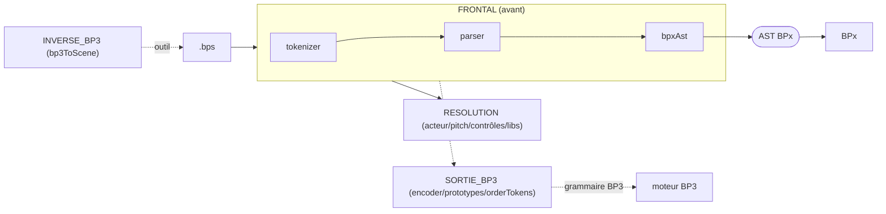

# Contrat d'architecture — transpileur BPScript (BROUILLON)

> **Ce qui DOIT être** (l'intention). Brouillon dérivé des drivers : `hub/contrats/bpscript-bpx.md`
> (étalon de frontière), `docs/spec/{EBNF,AST}.md`, `src/transpiler/_AUTORITE.md`, la règle BPx-only
> (CLAUDE.md). **Non ratifié** — l'architecte valide, Romain ratifie. Marqueurs :
> ✅ratifié · ⚙️dérivé-du-code · 🔶proposé · ❓question-Romain.

## 1. Fonctionnel — ce que fait le module

Le transpileur transforme un texte source `.bps` en **AST agnostique du moteur** destiné à BPx
(voie active), et — héritage — en **grammaire BP3** (voie figée). ⚙️

- **Voie BPx (active)** : `source → tokenizer → parser → bpxAst → AST`. L'AST est la **source unique**
  (zéro table parallèle) ; chaque jeton porte sa charge (`payload`), l'acteur/pitch/contrôles sont
  résolus DANS l'arbre. ✅ (directive Romain 2026-06-17)
- **Voie BP3 (héritée)** : `source → parser → encoder (+ prototypes) → grammaire BP3`. **NE JAMAIS
  TOUCHER** sauf demande explicite. ✅ (règle BPx-only, CLAUDE.md)
- **Voie inverse** : `bp3ToScene` reconstruit du `.bps` depuis une grammaire BP3 (`-gr.`). ⚙️

## 2. Contextuel — place dans le flux, voisins, lois

```
.bps ──▶ [TRANSPILEUR BPScript] ──ast──▶ BPx ──▶ Kronos ──▶ runtimes
                  │
                  └──grammaire BP3 (héritée)──▶ moteur BP3 WASM
```

- **Aval** : BPx consomme l'AST (`compileToBPxAST`). Frontière figée = `hub/contrats/bpscript-bpx.md`,
  conforme à `BPx/docs/AST_SPEC.md` v1. ✅
- **Lois cross-repo** :
  - **BPx-only** : l'AST ne contient AUCUNE notion BP3 (`_xxx(N)`, `flavor:'bp3'`…). ✅
  - **Source unique** : tout vit dans l'arbre ; pas de table parallèle (backticks/flags/libs). ✅
  - **Sémantique du langage = Romain** : toute évolution du SENS du langage s'escalade, ne se
    tranche pas dans le transpileur. ✅
  - Toute modif de forme d'AST → amender `hub/contrats/bpscript-bpx.md`. ✅ (`_AUTORITE.md`)

## 3. Interface — frontières de MODULE (la partie la plus scrutée)

### 3a. Frontières EXTERNES (figées — contrat)

| Frontière | Propriétaire | Sens | Forme / type exact | Invariant |
|---|---|---|---|---|
| `compileToBPxAST(source)` | index.js → bpxAst.js | BPScript ▶ BPx | `{ ast, errors, warnings }` | AST conforme AST_SPEC v1 ; agnostique moteur ; source unique |
| `ast` (charge par jeton) | bpxAst/parser | BPScript ▶ BPx | `payload{ nature, actor?, params?, address?, interp?, occurrence? }` | BPx PORTE sans interpréter ; dispatcher route |
| homomorphismes | encoder→résultat | BPScript ▶ BPx | `scene.homomorphisms=[{type,name,pairs,line}]` | noms canon. `*`/`+`/`;` ; chaînes dépliées |
| tempo | parser | BPScript ▶ BPx | `TempoOp{ scope:'absolute'\|'relative' }` | BPx lit `scope`, ne devine pas par position |
| graine | parser | BPScript ▶ BPx | `InstantControl{…directives:[{name:'seed',value}]}` | restreint à `seed` ; `_srand(N)` en aval |
| `compileBPS(source)` | index.js | BPScript ▶ moteur BP3 | `{ grammar, alphabetFile, prototypesFile, controlTable, cvTable, errors }` | **HÉRITÉ — figé, ne pas toucher** |

> ⚠️ **Dérive code** : l'en-tête `index.js:7` décrit encore `compileToBPxAST → { ast, backticks,
> flagStates, libraries }` (tables parallèles **supprimées**). La sortie réelle est
> `{ ast, errors, warnings }` (cf. `bpxAst.js:180`). Commentaire à corriger. 🔶

### 3b. Frontières INTERNES (NON figées — carte seulement)

Catalogue de nœuds AST (`docs/spec/AST.md`) : `Scene`, `Directive`, `ActorDirective`,
`SoundPrototypeAST`, `Subgrammar`, `Rule`, `Guard`, `Qualifier`, `Symbol`, `Polymetric`, `CVInstance`…
**Ne pas figer** ces frontières entre fichiers : elles doivent rester refactorables. ⚙️

## 4. Topologie voulue (cible, pas le décalque du code actuel)



Principes cibles :
- **FRONTAL et RESOLUTION** = le cœur vivant (refactorable librement). ⚙️
- **SORTIE_BP3** = zone gelée (héritage), isolée ; la voie propre `bpxAst` ne la touche jamais
  (loi BPx-only, **gardée** — `docs/arch/garde-preuve.md`). ✅
- **OUTILLAGE** (7 scripts CLI) = points d'entrée, hors bibliothèque ; ne doivent pas être importés
  par le cœur. ⚙️ (gardé : règle `core-no-tooling`)
- ❓ **`constants.js`** : table d'opérateurs BP3, partagée parser↔encoder. Place voulue = infra
  partagée ou rattachée à SORTIE_BP3 ? — à arbitrer.
- ❓ **`orderTokens.js`** : pendant dans le dépôt (consommateurs hors périmètre). Garder/exporter
  proprement vers Kanopi, ou retirer ? — à arbitrer.
